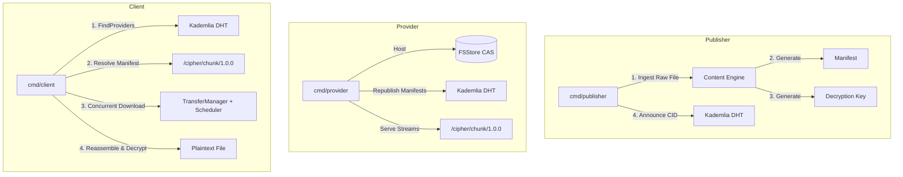
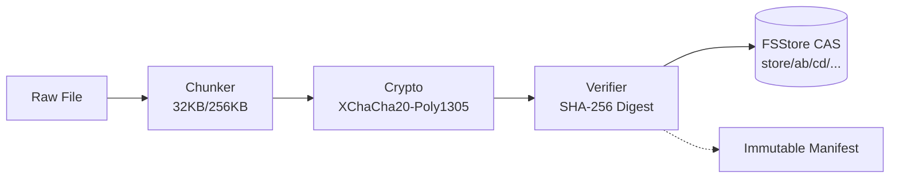
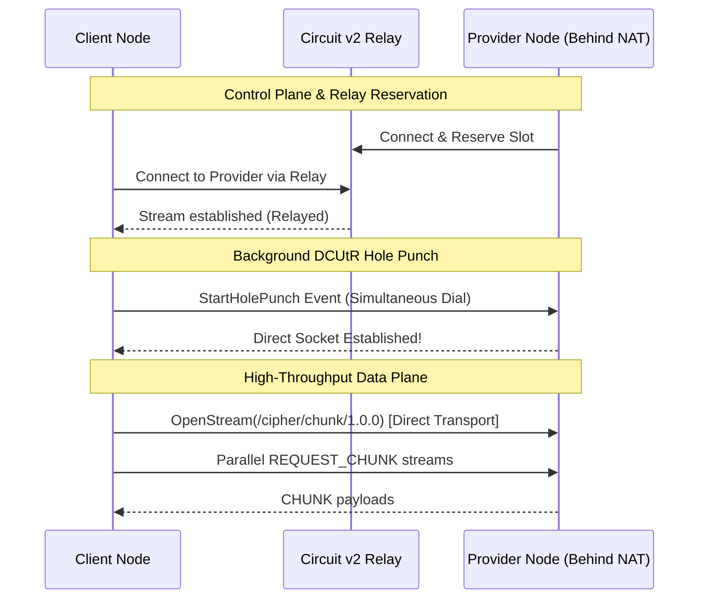
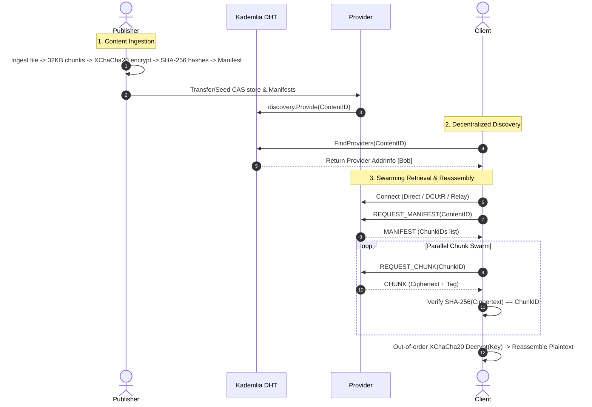

# CIPHER P2P Protocol Architecture

Welcome to the **CIPHER** protocol architecture guide. This document serves as the comprehensive technical reference for new and existing team members to understand the design, subsystems, and data flows of the CIPHER decentralized content delivery network.

---

## 1. Executive Summary & Vision

Centralized CDNs (Cloudflare, Fastly, CloudFront) are controlled by a handful of corporate entities. **CIPHER** is the alternative: a fully decentralized, content-addressed, and encrypted content delivery network where cryptography and peer-to-peer swarming replace centralized intermediaries.

### Core Architectural Principles
1. **Decoupled Capabilities**: Content description (immutable Manifest) is decoupled from decryption rights (Content Key).
2. **Encrypted Content-Addressing**: Data is chunked and encrypted independently (XChaCha20-Poly1305); chunks are identified strictly by the SHA-256 digest of their **ciphertext**.
3. **Strict Control Plane vs. Data Plane Separation**: The Kademlia DHT is used exclusively for routing and provider discovery (`CID -> Provider PeerIDs`), while heavy data transfers occur over an optimized peer-to-peer wire protocol (`/cipher/chunk/1.0.0`).
4. **Client-Side Swarming & Session State**: Multi-peer downloading, scheduling, retries, and resume tracking are maintained entirely on the client, keeping serving providers completely stateless.
5. **Universal Connectivity**: Multi-transport support (TCP, WebSocket, QUIC) with automatic NAT traversal via libp2p `circuitv2` relays and transparent background socket upgrades via **DCUtR (Direct Connection Upgrade through Relay)**.

---

## 2. High-Level Architecture

```text
┌─────────────────────────────────────────────────────────────────────────────┐
│                              CONTROL PLANE                                  │
│                                                                             │
│      Bootstrap ──────────► Kademlia DHT ◄────────── Content Announcement    │
│          │                 (Provider Records)                │              │
│          └──────────────► Relay (Circuit v2) ◄───────────────┘              │
│                         (NAT Traversal & DCUtR)                             │
└─────────────────────────────────────────────────────────────────────────────┘
                                      │
                                      │ Provider Discovery (CID -> PeerIDs)
                                      ▼
┌─────────────────────────────────────────────────────────────────────────────┐
│                                DATA PLANE                                   │
│                                                                             │
│     Publisher                Provider A           Provider B                │
│   (Ingest/Seed)              (CAS Store)          (CAS Store)               │
│         │                         │                    │                    │
│         └──────────────┐          │                    │                    │
│                        ▼          ▼                    ▼                    │
│                     Client (/cipher/chunk/1.0.0 Streams)                    │
│                        │                                                    │
│                        ├─ Parallel Fetch (Scheduler Worker Pool)            │
│                        ├─ Verify Ciphertext Hash (SHA-256)                  │
│                        ├─ Decrypt Out-of-Order (XChaCha20)                  │
│                        └─ Reassemble Plaintext via Manifest                 │
└─────────────────────────────────────────────────────────────────────────────┘
```

---

## 3. Protocol Roles & Binary Entrypoints (`cmd/`)

Rather than relying on monolithic nodes, CIPHER implements clean, decoupled protocol roles sharing the same core internal libraries:

```text
cmd/
├── publisher/       # Ingests raw content, generates manifests & encryption keys, announces to DHT
├── provider/        # Long-running daemon hosting CAS store, advertises hosted manifests, serves chunks
├── client/          # Consumer CLI for discovering providers, parallel swarming retrieval, decryption & reassembly
├── bootstrap/       # Kademlia DHT routing and network rendezvous node
├── relay/           # Circuit v2 Relay node for NAT traversal and DCUtR coordination
└── peer/            # Backward-compatible monolithic node (for legacy scripts)
```

### Role Breakdown



---

## 4. Subsystems & Core Packages (`internal/`)

### 4.1 Content Engine Foundation (`internal/content`)
The Content Engine is a modular, standalone pipeline that decouples data processing from network transport:

* **Chunker (`internal/content/chunker`)**: Slices data streams into fixed or variable chunks (default: 32KB for fast transfers / 256KB for bulk storage).
* **Crypto (`internal/content/crypto`)**: Authenticated encryption using **XChaCha20-Poly1305** with random 192-bit (24-byte) nonces. Each chunk is encrypted independently, enabling random access, out-of-order decryption, and parallel processing.
* **Verifier (`internal/content/verifier`)**: Computes SHA-256 digests over **ciphertext** to yield strong 32-byte identifiers (`ChunkID` and `ContentID`).
* **Manifest (`internal/content/manifest`)**: Generates immutable cryptographic capability structures. Decouples the **content layout** (ordered ChunkIDs, chunk sizes, root hash) from the **decryption key**.
* **Storage (`internal/content/storage`)**: Implements `ChunkSource`, `ChunkSink`, and `ManifestStore`. The default `FSStore` shards chunks into hex-prefixed subdirectories (e.g., `store/ab/cd/abcdef123...`) to avoid filesystem inode degradation.



---

### 4.2 Data Transfer Protocol (`internal/protocol/chunk`)
Protocol ID: `/cipher/chunk/1.0.0`

The data plane protocol is strictly stateless, binary, and optimized for high throughput.

#### Wire Message Envelope
```text
┌────────────────┬───────────────┬────────────────┬──────────────────────────┐
│  Version (1B)  │   Type (1B)   │  Length (4B)   │      Payload (NB)        │
└────────────────┴───────────────┴────────────────┴──────────────────────────┘
```

#### Supported Message Types:
1. `MsgRequestManifest` (0x01): Requests the manifest for a given 32-byte `ContentID`.
2. `MsgManifest` (0x02): Returns serialized manifest bytes.
3. `MsgRequestChunk` (0x03): Requests an encrypted chunk by 32-byte `ChunkID`.
4. `MsgChunk` (0x04): Transmits header metadata + encrypted chunk ciphertext.
5. `MsgAck` (0x05): Acknowledges chunk receipt.
6. `MsgError` (0x06): Communicates error codes (`ErrNotFound`, `ErrCorrupted`, `ErrBadRequest`).

---

### 4.3 Remote Ingestion & Replication Protocol (`internal/protocol/push` & `internal/distribution`)
Protocol ID: `/cipher/push/1.0.0`

While `/cipher/chunk/1.0.0` handles stateless public reading, `/cipher/push/1.0.0` provides a dedicated write plane for publishers to push encrypted content to remote providers.

#### Key Characteristics:
* **Write-Gate Isolation (`-allow-push`)**: Providers can independently enable or disable ingestion without impacting existing chunk downloads.
* **Assigned Chunk Set Negotiation**: The publisher transmits `MsgPushManifest` with `AssignedChunkIDs[]`. Providers verify that incoming chunks strictly belong to both the manifest and the assigned set before writing to disk.
* **Atomic & Idempotent CAS Writes**: Chunks are written to temporary staging files, synced (`fsync`), and atomically renamed (`os.Rename`) to `store/ab/cd/<ChunkID>`.
* **Staged Ingestion (`PENDING` $\to$ `READY`)**: Content remains in a staging area and is only announced to the DHT (`discovery.Provide`) when all assigned chunks are committed.
* **Multi-Provider Circular Placement**: `distribution.PlanPlacement` assigns chunks to $R$ distinct providers via circular stride.
* **Global Replication Invariant**: `distribution.GlobalReplicaTracker` enforces that the publisher exits with code 0 **only when** every chunk has $\ge R$ committed replicas across the provider mesh.

---

### 4.4 Swarming & Transfer Orchestration (`internal/transfer`)

```text
Application (CLI, Client)
        │
        ▼
TransferManager (Session state, bitset tracking, retry policies)
        │
        ▼
Scheduler (Thread-safe chunk queue, worker assignment)
        │
   ┌────┴────┐
   ▼         ▼
Worker 1   Worker 2 ... (Concurrent /cipher/chunk streams to Provider A, B)
   │         │
   └────┬────┘
        ▼
Content Engine (Verify SHA-256 -> CAS Storage -> Decrypt -> Reassemble)
```

* **`TransferManager` (`internal/transfer/manager`)**: Manages transfer lifecycles and non-blocking progress tracking. Persists session state (`sessions/<ContentID>.json`) using a boolean bitset to guarantee atomic resume and idempotent skips.
* **`Scheduler` (`internal/transfer/scheduler`)**: Distributes `ChunkTask` work across an active `Worker` pool connecting to discovered seed providers. If a provider drops or corrupts a chunk, tasks are requeued and reassigned to healthy peers.

---

### 4.4 Control Plane & Discovery (`internal/discovery`)
CIPHER utilizes libp2p's Kademlia DHT (`go-libp2p-kad-dht`) in Server Mode.

* **Bootstrap (`Bootstrap`)**: Connects nodes to the DHT routing mesh via known bootstrap nodes.
* **Provide (`Provide`)**: Announces to the DHT that the local node provides a specific `ContentID`.
* **FindProviders (`FindProviders`)**: Queries the DHT routing table for provider records advertising a given `ContentID`.
* **Republisher (`StartRepublisher`)**: Background daemon on Provider nodes that lists all local manifests from `FSStore` and re-announces them to the DHT periodically (default: every 12 hours) and immediately upon node startup.

---

### 4.5 Transport & NAT Traversal (`internal/transport`)

* **Multi-Transport Support**:
  * Standard TCP (`/ip4/.../tcp/4001`)
  * WebSocket (`/ip4/.../tcp/4002/ws`) for firewall evasion and browser compatibility
  * UDP / QUIC (`/ip4/.../udp/4002/quic-v1`)
* **Transport Abstraction (`Transport`)**: Provides a clean interface (`Connect`, `ConnectPeer`, `OpenStream`) delegating connection routing to libp2p.
* **Circuit v2 Relays & DCUtR Hole Punching**:
  1. Nodes behind NATs automatically connect to static `circuitv2` public relays and reserve transient slots.
  2. When a remote peer connects via the relay address (`/p2p-circuit/...`), libp2p's **DCUtR** service triggers simultaneous UDP/TCP hole punching in the background.
  3. Upon successful hole punch, libp2p transparently upgrades all new application streams to a high-speed direct socket.



---

### 4.6 Identity Management (`internal/identity`)
* Generates and marshals persistent Ed25519 cryptographic keypairs.
* Stores keys in platform-specific user config directories (`~/.config/cipher/`, `Library/Application Support/CIPHER/`, `AppData/Roaming/CIPHER/`) or custom paths via `-identity <path>`.
* Guarantees immutable `PeerID`s across process restarts.

---

## 5. End-to-End Workflow: Ingest to Retrieval



---

## 6. Directory Layout Reference

```text
CIPHER/
├── p2p_transport/
│   ├── cmd/
│   │   ├── publisher/           # Content ingestion and seeding entrypoint
│   │   ├── provider/            # Persistent CAS hosting and chunk serving daemon
│   │   ├── client/              # Content retrieval and reassembly CLI
│   │   ├── bootstrap/           # DHT bootstrap rendezvous node
│   │   ├── relay/               # Circuit v2 Relay node
│   │   ├── content-test/        # Offline content engine testing utility
│   │   └── peer/                # Legacy all-in-one peer entrypoint
│   ├── internal/
│   │   ├── content/             # Chunker, Crypto (XChaCha20), Digest, Manifest, FSStore
│   │   ├── discovery/           # DHT initialization, Provide, FindProviders, Republisher
│   │   ├── distribution/        # Circular stride placement planner, GlobalReplicaTracker, Uploader
│   │   ├── identity/            # Ed25519 persistent and custom key management
│   │   ├── protocol/
│   │   │   ├── chunk/           # /cipher/chunk/1.0.0 wire messages, handler, client
│   │   │   └── push/            # /cipher/push/1.0.0 ingestion wire messages, handler, client
│   │   ├── retrieval/           # Manifest resolver helper
│   │   ├── transfer/            # TransferManager, FileSessionManager, Scheduler, Worker pool
│   │   └── transport/           # libp2p Host creation, Multi-transport, AutoNAT, DCUtR
│   ├── docs/
│   │   ├── architecture.md      # This document
│   │   ├── testing.md           # Testing guide and scenarios
│   │   ├── relay_deployment.md  # Cloud relay deployment guide
│   │   └── roadmap.md           # Project roadmap and milestones
│   └── test/
│       └── robustness/          # 1000-iteration engine robustness tests
├── test_remote_push.sh          # Multi-provider push & fault tolerance test (Phase 4)
├── test_roles.sh                # Automated role integration test script
├── test_provider_independent.sh # Provider independence & restart persistence test script
└── test_transfer.sh             # Legacy peer transfer script
```
