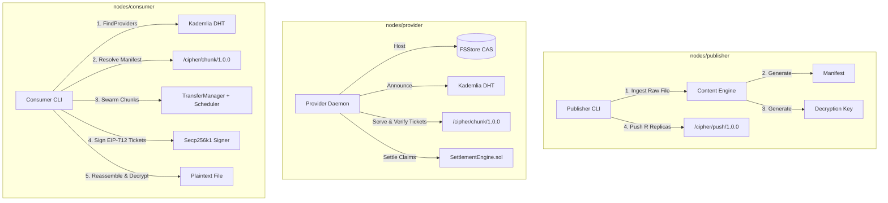
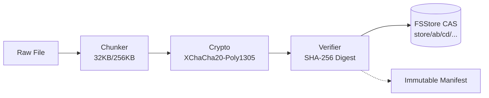
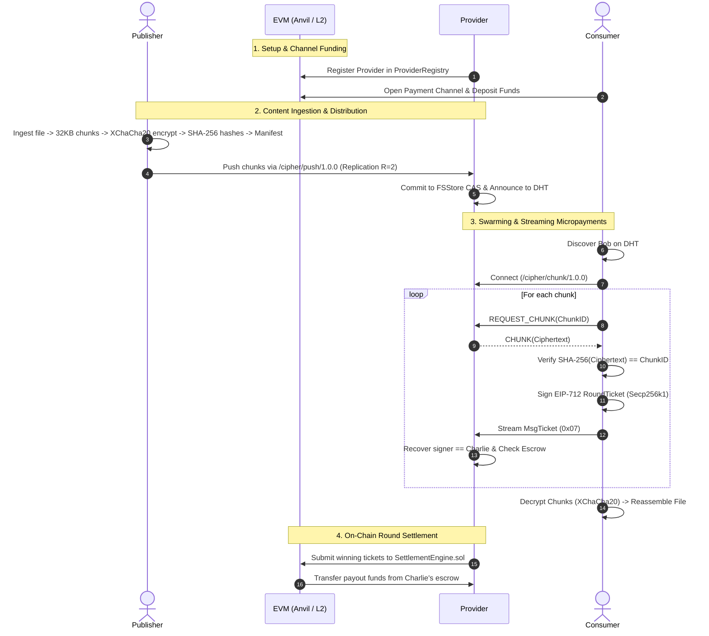

# CIPHER P2P Protocol Architecture

Welcome to the **CIPHER** protocol architecture guide. This document serves as the comprehensive technical reference for understanding the design, subsystems, cryptographic mechanisms, network protocols, and economic settlement layers of the CIPHER decentralized content delivery network.

---

## 1. Executive Summary & Vision

Centralized CDNs (Cloudflare, Fastly, CloudFront) are controlled by a handful of corporate entities. **CIPHER** is the trust-minimized alternative: a fully decentralized, content-addressed, encrypted, and economically incentivized content delivery network where cryptography, peer-to-peer swarming, and EVM smart contracts replace centralized intermediaries.

### Core Architectural Principles
1. **Decoupled Capabilities**: Content description (immutable Manifest) is decoupled from decryption rights (Content Key).
2. **Encrypted Content-Addressing**: Data is chunked and encrypted independently (XChaCha20-Poly1305); chunks are identified strictly by the SHA-256 digest of their **ciphertext**.
3. **Strict Plane Separation**:
   - **Control Plane**: Kademlia DHT for routing & provider discovery (`CID -> Provider PeerIDs`), Circuit v2 relays for NAT traversal.
   - **Data Plane**: High-throughput chunk streaming (`/cipher/chunk/1.0.0`) and remote replication (`/cipher/push/1.0.0`).
   - **Economic Settlement Plane**: Zero-gas off-chain EIP-712 probabilistic micropayments with batched on-chain settlement.
4. **Client-Side Swarming & Session State**: Multi-peer downloading, scheduling, retries, and resume tracking are maintained entirely on the client, keeping serving providers completely stateless.
5. **Universal Connectivity**: Multi-transport support (TCP, WebSocket, QUIC) with automatic NAT traversal via libp2p `circuitv2` relays and transparent background socket upgrades via **DCUtR (Direct Connection Upgrade through Relay)**.
6. **Dual Identity Architecture**: Independent Ed25519 keys for libp2p network addressing paired with Secp256k1 keys for EVM payment authorization.

---

## 2. High-Level Architecture

```text
┌─────────────────────────────────────────────────────────────────────────────────────────┐
│                                     CONTROL PLANE                                       │
│                                                                                         │
│        Bootstrap ──────────► Kademlia DHT ◄────────── Content Announcement              │
│            │                 (Provider Records)                │                        │
│            └──────────────► Relay (Circuit v2) ◄───────────────┘                        │
│                           (NAT Traversal & DCUtR)                                       │
└─────────────────────────────────────────────────────────────────────────────────────────┘
                                         │
                                         │ Provider Discovery (CID -> PeerIDs)
                                         ▼
┌─────────────────────────────────────────────────────────────────────────────────────────┐
│                                      DATA PLANE                                         │
│                                                                                         │
│       Publisher                Provider A           Provider B                          │
│     (Ingest/Seed)              (CAS Store)          (CAS Store)                         │
│           │                         │                    │                              │
│           └──────────────┐          │                    │                              │
│                          ▼          ▼                    ▼                              │
│                       Consumer (/cipher/chunk/1.0.0 Streams)                            │
│                          │                                                              │
│                          ├─ Parallel Fetch (Scheduler Worker Pool)                      │
│                          ├─ Verify Ciphertext Hash (SHA-256)                            │
│                          ├─ Stream Micropayment Tickets (MsgTicket 0x07)                │
│                          ├─ Decrypt Out-of-Order (XChaCha20)                            │
│                          └─ Reassemble Plaintext via Manifest                           │
└─────────────────────────────────────────────────────────────────────────────────────────┘
                                         │
                                         │ Claim Aggregation & Lottery Settlement
                                         ▼
┌─────────────────────────────────────────────────────────────────────────────────────────┐
│                              ECONOMIC SETTLEMENT PLANE                                  │
│                                                                                         │
│    PaymentChannel.sol         SettlementEngine.sol        CommitRevealEntropy.sol       │
│    (Deposits & Balances)      (Lottery & Payouts)         (Round Entropy Source)        │
│             ▲                          ▲                             ▲                  │
│             └──────────────────────────┴─────────────────────────────┘                  │
│                                        │                                                │
│                                ProviderRegistry.sol                                     │
│                               (Staked Node Registry)                                    │
└─────────────────────────────────────────────────────────────────────────────────────────┘
```

---

## 3. Protocol Roles & Binary Entrypoints

CIPHER implements clean, decoupled protocol roles sharing core internal libraries:

```text
nodes/
├── publisher/       # Ingests raw content, generates manifests & keys, pushes to providers with R replicas
├── provider/        # Long-running daemon hosting CAS store, advertises CIDs, verifies tickets, serves chunks
└── consumer/        # Client CLI: discovers providers, swarms chunks, signs EIP-712 tickets, decrypts
network/cmd/
├── bootstrap/       # Kademlia DHT routing and network rendezvous node
├── relay/           # Circuit v2 Relay node for NAT traversal and DCUtR coordination
└── peer/            # Backward-compatible monolithic node
```

### Role Breakdown


```mermaid
graph TD
    subgraph Publisher [nodes/publisher]
        Pub[Publisher CLI] -->|1. Ingest Raw File| CE_Pub[Content Engine]
        CE_Pub -->|2. Generate| Man[Manifest]
        CE_Pub -->|3. Generate| Key[Decryption Key]
        Pub -->|4. Push R Replicas| Push["/cipher/push/1.0.0"]
    end

    subgraph Provider [nodes/provider]
        Prov[Provider Daemon] -->|Host| CAS[(FSStore CAS)]
        Prov -->|Announce| DHT_Prov[Kademlia DHT]
        Prov -->|Serve & Verify Tickets| Proto_Prov["/cipher/chunk/1.0.0"]
        Prov -->|Settle Claims| EVM_Prov[SettlementEngine.sol]
    end

    subgraph Consumer [nodes/consumer]
        Cli[Consumer CLI] -->|1. FindProviders| DHT_Cli[Kademlia DHT]
        Cli -->|2. Resolve Manifest| Proto_Cli["/cipher/chunk/1.0.0"]
        Cli -->|3. Swarm Chunks| TM[TransferManager + Scheduler]
        Cli -->|4. Sign EIP-712 Tickets| Secp[Secp256k1 Signer]
        Cli -->|5. Reassemble & Decrypt| Out[Plaintext File]
    end
```

---

## 4. Subsystems & Core Packages

### 4.1 Content Engine Foundation (`network/content`)
The Content Engine is a modular, standalone pipeline that decouples data processing from network transport:

* **Chunker (`network/content/chunker`)**: Slices data streams into fixed or variable chunks (default: 32KB for fast swarming / 256KB for bulk storage).
* **Crypto (`network/content/crypto`)**: Authenticated encryption using **XChaCha20-Poly1305** with random 192-bit (24-byte) nonces. Each chunk is encrypted independently, enabling random access, out-of-order decryption, and parallel processing.
* **Verifier (`network/content/verifier`)**: Computes SHA-256 digests over **ciphertext** to yield strong 32-byte identifiers (`ChunkID` and `ContentID`).
* **Manifest (`network/content/manifest`)**: Generates immutable cryptographic capability structures. Decouples the **content layout** (ordered ChunkIDs, chunk sizes, root hash) from the **decryption key**.
* **Storage (`network/content/storage`)**: Implements `ChunkSource`, `ChunkSink`, and `ManifestStore`. The default `FSStore` shards chunks into hex-prefixed subdirectories (e.g., `store/ab/cd/abcdef123...`) to avoid filesystem inode degradation.


```mermaid
graph LR
    Raw[Raw File] --> Chunker[Chunker<br/>32KB/256KB]
    Chunker --> Crypto[Crypto<br/>XChaCha20-Poly1305]
    Crypto --> Verifier[Verifier<br/>SHA-256 Digest]
    Verifier --> CAS[(FSStore CAS<br/>store/ab/cd/...)]
    Verifier -.-> Manifest[Immutable Manifest]
```

---

### 4.2 Data Transfer Protocol (`network/protocol/chunk`)
Protocol ID: `/cipher/chunk/1.0.0`

The data plane protocol is strictly stateless, binary, and optimized for high throughput.

#### Wire Message Envelope
```text
┌────────────────┬───────────────┬────────────────┬──────────────────────────┐
│  Version (1B)  │   Type (1B)   │  Length (4B)   │      Payload (NB)        │
└────────────────┴───────────────┴────────────────┴──────────────────────────┘
```

#### Supported Message Types:
| Type Code | Constant | Description | Payload |
| :--- | :--- | :--- | :--- |
| `0x01` | `MsgRequestManifest` | Requests manifest by `ContentID` | 32-byte ContentID |
| `0x02` | `MsgManifest` | Returns serialized manifest | Protobuf / Binary Manifest |
| `0x03` | `MsgRequestChunk` | Requests chunk by `ChunkID` | 32-byte ChunkID |
| `0x04` | `MsgChunk` | Transmits chunk payload | 32B ChunkID + 4B Size + Ciphertext |
| `0x05` | `MsgAck` | Acknowledges receipt of chunk | 32-byte ChunkID |
| `0x06` | `MsgError` | Communicates protocol errors | 1B ErrorCode + Variable Text |
| `0x07` | `MsgTicket` | EIP-712 micropayment ticket | 32B ChannelID + 32B RoundID + 8B Nonce + 32B FaceVal + 32B Prob + 65B Sig |

#### Ticket Streaming & Validation Rules:
1. When a consumer requests chunks, it streams a corresponding `MsgTicket (0x07)` over the chunk stream.
2. The provider validates:
   - Payload length matches ticket envelope specification (`MaxTicketSize = 4096`).
   - Signature recovers valid consumer Ethereum address via EIP-712 typed digest.
   - Nonce strictly advances previous accepted nonce for this round.
   - Channel has sufficient funded escrow balance on-chain.

---

### 4.3 Remote Ingestion & Replication Protocol (`network/protocol/push` & `network/distribution`)
Protocol ID: `/cipher/push/1.0.0`

While `/cipher/chunk/1.0.0` handles stateless public reading, `/cipher/push/1.0.0` provides a dedicated write plane for publishers to push encrypted content to remote providers.

#### Key Characteristics:
* **Write-Gate Isolation (`-allow-push`)**: Providers can independently enable or disable ingestion without impacting existing chunk downloads.
* **Assigned Chunk Set Negotiation**: The publisher transmits `MsgPushManifest` with `AssignedChunkIDs[]`. Providers verify that incoming chunks strictly belong to both the manifest and the assigned set before writing to disk.
* **Atomic & Idempotent CAS Writes**: Chunks are written to temporary staging files, synced (`fsync`), and atomically renamed (`os.Rename`) to `store/ab/cd/<ChunkID>`.
* **Staged Ingestion (`PENDING` $\to$ `READY`)**: Content remains in a staging area and is only announced to the DHT (`discovery.Provide`) when all assigned chunks are committed.
* **Multi-Provider Circular Placement**: `distribution.PlanPlacement` assigns chunks to $R$ distinct providers via circular stride.
* **Global Replication Invariant**: `distribution.GlobalReplicaTracker` enforces that the publisher exits with code 0 **only when** every chunk has $\ge R$ committed replicas across the provider mesh.

---

### 4.4 Swarming & Transfer Orchestration (`network/transfer`)

```text
Consumer Application (nodes/consumer)
        │
        ▼
TransferManager (Session state, bitset tracking, ticket generator binding)
        │
        ▼
Scheduler (Thread-safe chunk queue, worker assignment)
        │
   ┌────┴────┐
   ▼         ▼
Worker 1   Worker 2 ... (Concurrent /cipher/chunk streams with ticket payment)
   │         │
   └────┬────┘
        ▼
Content Engine (Verify SHA-256 -> CAS Storage -> Decrypt -> Reassemble)
```

* **`TransferManager` (`network/transfer/manager`)**: Manages transfer lifecycles and non-blocking progress tracking. Persists session state (`sessions/<ContentID>.json`) using a boolean bitset to guarantee atomic resume and idempotent skips.
* **`Scheduler` (`network/transfer/scheduler`)**: Distributes `ChunkTask` work across an active `Worker` pool connecting to discovered seed providers. When configured with a `TicketGeneratorFunc`, workers generate cryptographic EIP-712 tickets and stream them alongside chunk requests.

---

### 4.5 Control Plane & Discovery (`network/discovery`)
CIPHER utilizes libp2p's Kademlia DHT (`go-libp2p-kad-dht`) in Server Mode.

* **Bootstrap (`Bootstrap`)**: Connects nodes to the DHT routing mesh via known bootstrap nodes.
* **Provide (`Provide`)**: Announces to the DHT that the local node provides a specific `ContentID`.
* **FindProviders (`FindProviders`)**: Queries the DHT routing table for provider records advertising a given `ContentID`.
* **Republisher (`StartRepublisher`)**: Background daemon on Provider nodes that lists all local manifests from `FSStore` and re-announces them to the DHT periodically (default: every 12 hours) and immediately upon node startup.

---

### 4.6 Transport & NAT Traversal (`network/transport`)

* **Multi-Transport Support**:
  * Standard TCP (`/ip4/.../tcp/4001`)
  * WebSocket (`/ip4/.../tcp/4002/ws`) for firewall evasion and browser compatibility
  * UDP / QUIC (`/ip4/.../udp/4002/quic-v1`)
* **Circuit v2 Relays & DCUtR Hole Punching**:
  1. Nodes behind NATs automatically connect to static `circuitv2` public relays and reserve transient slots.
  2. When a remote peer connects via the relay address (`/p2p-circuit/...`), libp2p's **DCUtR** service triggers simultaneous UDP/TCP hole punching in the background.
  3. Upon successful hole punch, libp2p transparently upgrades all new application streams to a high-speed direct socket.

---

### 4.7 Dual Identity Architecture (`network/identity`)

To maintain clean cryptographic separation of concerns, CIPHER nodes utilize two distinct key types:

```text
Node Identity Store (~/.config/cipher/ or custom -identity)
├── identity.key   (Ed25519: libp2p PeerID, wire transport auth, TLS handshakes)
└── eth.key        (Secp256k1: Ethereum address, EIP-712 payment authorization)
```

1. **Ed25519 (`network/identity/identity.go`)**:
   - Generates immutable libp2p `PeerID`.
   - Used for libp2p noise/TLS handshakes, DHT routing, and NAT hole punching.
2. **Secp256k1 (`network/identity/ethereum.go`)**:
   - Generates 256-bit ECDSA keypair protected with `0600` POSIX filesystem permissions.
   - Derives standard EVM address (`0x...`).
   - Signs typed EIP-712 micropayment tickets and on-chain transactions.

---

### 4.8 Economic Settlement & Micropayment Protocol (`network/payments` & `payments/src`)

Paying on-chain per chunk would be economically infeasible due to gas overhead. CIPHER utilizes **Probabilistic Micropayments (Lottery Tickets)**:

```text
Each chunk downloaded = 1 EIP-712 Ticket
Expected value per ticket = FaceValue × Probability
Only winning tickets are submitted on-chain for full FaceValue payout!
```

#### EIP-712 Domain & Type Definition:
```solidity
struct RoundTicket {
    bytes32 channelId;
    bytes32 roundId;
    uint64 nonce;
    uint256 faceValue;
    uint256 ticketProb;
}
```
* **Domain Name**: `CIPHER Payment Protocol`
* **Version**: `1.0.0`
* **Verifying Contract**: `SettlementEngine` address

#### Core Smart Contracts (`payments/src/core` & `randomness`):
1. **`PaymentChannel.sol`**:
   - Manages consumer escrow deposits.
   - Enforces unidirectional balance drawdowns and cooperative closures.
2. **`SettlementEngine.sol`**:
   - Verifies EIP-712 ticket signatures using OpenZeppelin `ECDSA`.
   - Resolves lottery winning condition against `CommitRevealEntropy.sol`.
   - Aggregates winning claims and executes batch payouts to providers.
3. **`CommitRevealEntropy.sol`**:
   - Provides unbiasable on-chain randomness for lottery ticket evaluation.
4. **`ProviderRegistry.sol`**:
   - Tracks registered providers and bonded collateral stakes.

#### Go Bindings & Subpackages (`network/payments/bindings`):
Generated via `abigen` into isolated subpackages to avoid Go struct namespace collisions:
* `bindings/paymentchannel`: Channel deposit and query interface.
* `bindings/settlementengine`: Claim verification and settlement interface.
* `bindings/commitreveal`: Entropy source interface.
* `bindings/providerregistry`: Staking registry interface.

---

## 5. End-to-End Workflow: Ingest to Retreival & Settlement


```mermaid
sequenceDiagram
    autonumber
    actor Alice as Publisher
    participant Eth as EVM (Anvil / L2)
    participant Bob as Provider
    actor Charlie as Consumer

    Note over Eth: 1. Setup & Channel Funding
    Bob->>Eth: Register Provider in ProviderRegistry
    Charlie->>Eth: Open Payment Channel & Deposit Funds

    Note over Alice, Bob: 2. Content Ingestion & Distribution
    Alice->>Alice: Ingest file -> 32KB chunks -> XChaCha20 encrypt -> SHA-256 hashes -> Manifest
    Alice->>Bob: Push chunks via /cipher/push/1.0.0 (Replication R=2)
    Bob->>Bob: Commit to FSStore CAS & Announce to DHT

    Note over Charlie, Bob: 3. Swarming & Streaming Micropayments
    Charlie->>Charlie: Discover Bob on DHT
    Charlie->>Bob: Connect (/cipher/chunk/1.0.0)
    loop For each chunk
        Charlie->>Bob: REQUEST_CHUNK(ChunkID)
        Bob-->>Charlie: CHUNK(Ciphertext)
        Charlie->>Charlie: Verify SHA-256(Ciphertext) == ChunkID
        Charlie->>Charlie: Sign EIP-712 RoundTicket (Secp256k1)
        Charlie->>Bob: Stream MsgTicket (0x07)
        Bob->>Bob: Recover signer == Charlie & Check Escrow
    end
    Charlie->>Charlie: Decrypt Chunks (XChaCha20) -> Reassemble File

    Note over Bob, Eth: 4. On-Chain Round Settlement
    Bob->>Eth: Submit winning tickets to SettlementEngine.sol
    Eth->>Bob: Transfer payout funds from Charlie's escrow
```

---

## 6. Repository Directory Layout Reference

```text
CIPHER/
├── network/                     # Decentralized CDN Networking Layer
│   ├── cmd/                     # Network auxiliary entrypoints
│   │   ├── bootstrap/           # DHT rendezvous & bootstrap node
│   │   ├── relay/               # Circuit v2 Relay node
│   │   └── peer/                # Monolithic peer node
│   ├── content/                 # Chunker, Crypto (XChaCha20), Digest, Manifest, FSStore
│   ├── discovery/               # DHT initialization, Provide, FindProviders, Republisher
│   ├── distribution/            # Circular stride placement planner, GlobalReplicaTracker
│   ├── identity/                # Ed25519 (P2P) and Secp256k1 (Ethereum) key management
│   ├── payments/                # Client, Signer, and generated abigen Go contract bindings
│   │   ├── bindings/            # Isolated Go bindings (paymentchannel, settlementengine, etc.)
│   │   ├── client.go            # ethclient wrapper & channel state inspector
│   │   └── signer.go            # EIP-712 typed hashing and ECDSA signing
│   ├── protocol/
│   │   ├── chunk/               # /cipher/chunk/1.0.0 wire protocol & MsgTicket (0x07)
│   │   └── push/                # /cipher/push/1.0.0 remote ingestion protocol
│   ├── retrieval/               # Manifest resolver helper
│   ├── transfer/                # TransferManager, Scheduler, Worker pool with ticket streaming
│   └── transport/               # libp2p Host, Multi-transport, AutoNAT, DCUtR
├── nodes/                       # Protocol Role Applications
│   ├── publisher/               # Ingestion & remote push distributor
│   ├── provider/                # Persistent CAS storage daemon & ticket verifier
│   └── consumer/                # Swarming downloader, ticket signer & file reassembler
├── payments/                    # Foundry Smart Contract Protocol
│   ├── src/                     # Core Solidity contracts (PaymentChannel, SettlementEngine, etc.)
│   ├── script/                  # Deployment & settlement scripts (Step1_Setup, Step2_Settle)
│   ├── test/                    # Foundry Forge test suites (46 unit & invariant tests)
│   └── README.md                # Payments subsystem documentation
├── tests/                       # Automated Integration & Lifecycle Tests
│   └── e2e/                     # End-to-end shell test suites (Anvil payments, push, roles)
├── scripts/                     # Developer utilities & workflow harnesses
│   └── test_full_workflow.sh    # Comprehensive master test runner script
├── docs/                        # Specifications and Guides
│   ├── architecture.md          # Comprehensive architecture specification (This document)
│   ├── testing.md               # Testing guide, test suites, and hardware setup
│   ├── roadmap.md               # Milestones and development roadmap
│   ├── relay_deployment.md      # Production Relay deployment guide
│   └── network_payments_integration.md # Technical specification: P2P network & payments integration
├── test_workflow.sh             # Master test suite runner
├── go.mod                       # Go module dependencies (libp2p, go-ethereum v1.14.12)
└── README.md                    # Project overview and quick start
```
