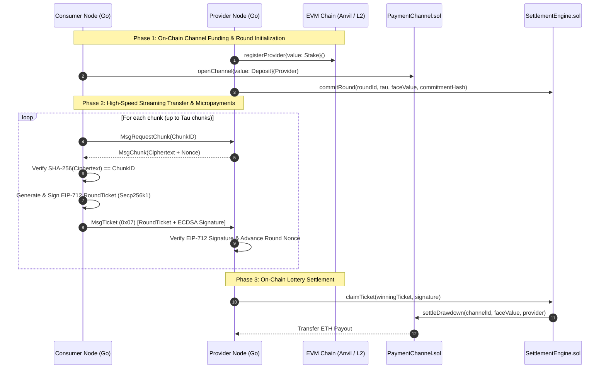

# CIPHER Technical Specification: Network & Payments Integration

| Attribute | Value |
| :--- | :--- |
| **Document Title** | P2P Networking & EVM Payments Integration Specification |
| **Status** | Implemented & Verified |
| **Target Subsystems** | `network/payments`, `network/protocol/chunk`, `payments/src`, `nodes/consumer`, `nodes/provider` |
| **Standards & Protocols** | EIP-712 (Typed Structured Data), libp2p `/cipher/chunk/1.0.0` (`MsgTicket 0x07`) |
| **Branch** | `feat/network-payments-integration` |

---

## 1. Executive Summary & Objective

In a decentralized content delivery network, storage providers must be economically compensated for caching and serving content chunks without introducing prohibitive on-chain gas costs or transfer latency. Executing an on-chain transaction for each individual 32KB/256KB chunk is economically impossible on Ethereum-compatible networks.

This specification details the end-to-end integration between the **libp2p P2P Networking Plane** (`network/`, `nodes/`) and the **EVM Smart Contract Protocol** (`payments/src/`). The architecture utilizes **Probabilistic Micropayments (Lottery Tickets)** combined with **Unidirectional Payment Channels**:

1. **Unidirectional Escrow**: Consumers deposit funds into an on-chain escrow channel (`PaymentChannel.sol`).
2. **Zero-Gas Streaming Tickets**: For each chunk received over `/cipher/chunk/1.0.0`, the consumer streams an off-chain EIP-712 signed `RoundTicket` (`MsgTicket 0x07`) with face value $V$ and winning probability $p$.
3. **Probabilistic Valuation**: The expected payout per chunk is $\mathbb{E}[V] = V \times p$, enabling micro-incentives without incurring on-chain transaction fees.
4. **Batched On-Chain Settlement**: Providers collect tickets off-chain and verify them in real time. Winning tickets (determined via `CommitRevealEntropy.sol`) are submitted to `SettlementEngine.sol` for batched on-chain payout.

---

## 2. Multi-Plane Architecture

```text
┌─────────────────────────────────────────────────────────────────────────────────────────┐
│                                      DATA PLANE                                         │
│                                                                                         │
│   Publisher                     Provider (nodes/provider)                               │
│  (Ingest/Seed)                 (FSStore CAS & Ticket Verifier)                          │
│        │                                     ▲                                          │
│        │ 1. Push R Replicas                  │ 2. /cipher/chunk/1.0.0                   │
│        │    (/cipher/push/1.0.0)             │    - Request Chunk                       │
│        ▼                                     │    - Stream Chunk                        │
│   Remote Storage                             │    - Stream MsgTicket (0x07)             │
│   Provider Pool                              ▼                                          │
│                                  Consumer (nodes/consumer)                              │
│                                (Swarming & EIP-712 Signer)                              │
└──────────────────────────────────────────────┬──────────────────────────────────────────┘
                                               │
                                               │ 3. Channel Deposit & Round Claims
                                               ▼
┌─────────────────────────────────────────────────────────────────────────────────────────┐
│                              ECONOMIC SETTLEMENT PLANE                                  │
│                                                                                         │
│    PaymentChannel.sol         SettlementEngine.sol        CommitRevealEntropy.sol       │
│    (Deposits & Escrow)        (Lottery & Payouts)         (Round Entropy Source)        │
│             ▲                          ▲                             ▲                  │
│             └──────────────────────────┴─────────────────────────────┘                  │
│                                        │                                                │
│                                ProviderRegistry.sol                                     │
│                               (Staked Node Registry)                                    │
└─────────────────────────────────────────────────────────────────────────────────────────┘
```

---

## 3. Protocol Interaction Sequence



---

## 4. Cryptographic Specification

### 4.1 Dual Identity Separation
Nodes maintain two cryptographically independent keypairs stored in the platform configuration directory (`~/.config/cipher/` or custom `-identity` path):

1. **P2P Transport Identity (`identity.key`)**:
   - Algorithm: **Ed25519**
   - Purpose: Generates libp2p `PeerID`, authenticates TLS/Noise handshakes, handles DHT routing.
2. **EVM Settlement Identity (`eth.key`)**:
   - Algorithm: **ECDSA Secp256k1**
   - Purpose: Derives 20-byte Ethereum address (`0x...`), signs EIP-712 payment tickets and on-chain transactions.
   - Storage Security: Guarded with strict `0600` POSIX filesystem permissions.

### 4.2 EIP-712 Typed Structured Data

Tickets exchanged across `/cipher/chunk/1.0.0` streams conform strictly to the EIP-712 specification.

#### Domain Separator:
* **Name**: `CIPHER Payment Protocol`
* **Version**: `1.0.0`
* **ChainID**: Dynamic network ID (e.g. `31337` on Anvil, network-defined on testnets/mainnet)
* **Verifying Contract**: Address of deployed `SettlementEngine.sol`

#### Struct Definition:
```solidity
struct RoundTicket {
    bytes32 channelId;
    bytes32 roundId;
    uint64 nonce;
    uint256 faceValue;
    uint256 ticketProb;
}
```

#### Typed Hash Derivation:
$$\text{TypeHash} = \text{keccak256}("RoundTicket(bytes32 channelId,bytes32 roundId,uint64 nonce,uint256 faceValue,uint256 ticketProb)")$$

$$\text{StructHash} = \text{keccak256}(\text{TypeHash} \parallel \text{channelId} \parallel \text{roundId} \parallel \text{nonce} \parallel \text{faceValue} \parallel \text{ticketProb})$$

$$\text{Digest} = \text{keccak256}("\backslash x19\backslash x01" \parallel \text{DomainSeparator} \parallel \text{StructHash})$$

Signatures are verified via `ecrecover(Digest, v, r, s)` with full parity against OpenZeppelin's `ECDSA.sol`.

---

## 5. Wire Protocol Extension (`/cipher/chunk/1.0.0`)

### 5.1 Message Framing
Ticket streaming uses message code `0x07` (`MsgTicket`) within the binary chunk protocol:

```text
┌────────────────┬───────────────┬────────────────┬──────────────────────────┐
│  Version (1B)  │   Type (1B)   │  Length (4B)   │      Payload (NB)        │
│      0x01      │     0x07      │    uint32      │     Ticket Payload       │
└────────────────┴───────────────┴────────────────┴──────────────────────────┘
```

### 5.2 Wire Safety Limits
* `MaxTicketSize = 4096` bytes. Incoming packets exceeding this size trigger an immediate protocol fault (`ErrBadRequest`) without allocation bloat.
* Payloads are serialized using deterministic JSON framing containing the ticket struct fields alongside the 65-byte hex-encoded ECDSA signature.

### 5.3 Provider Verification Rules
When the provider's `TicketHandlerFunc` receives a `MsgTicket`:
1. **Payload Bounds**: Verifies payload length $\le 4096$ bytes.
2. **Signature Recovery**: Recovers the signer's Ethereum address from the EIP-712 typed digest.
3. **Channel Matching**: Confirms the recovered address matches the consumer assigned to `channelId`.
4. **Monotonic Nonce**: Confirms ticket `nonce` strictly advances the previously recorded nonce for the `roundId` to prevent replay attacks.
5. **Solvency Check**: Verifies consumer channel balance remains $\ge \text{faceValue}$.

---

## 6. Smart Contract Architecture (`payments/src/`)

| Contract | Location | Primary Responsibilities |
| :--- | :--- | :--- |
| **`PaymentChannel.sol`** | `payments/src/core/` | Escrows consumer deposits. Tracks cumulative claims, executes provider drawdowns, and manages channel lifecycles. |
| **`SettlementEngine.sol`** | `payments/src/core/` | Central clearinghouse. Verifies EIP-712 signatures, queries entropy, determines lottery outcomes, and authorises payouts from `PaymentChannel`. |
| **`CommitRevealEntropy.sol`** | `payments/src/randomness/` | Unbiasable round entropy source ensuring neither party can predetermine winning lottery nonces. |
| **`ProviderRegistry.sol`** | `payments/src/core/` | Maintains bonded provider registrations and tracks collateral stakes. |
| **`ChunkDisputeResolver.sol`** | `payments/src/core/` | Merkle dispute arbitrator for withheld or corrupted chunks (deferred phase). |

---

## 7. Go Ethereum Integration Layer (`network/payments/`)

### 7.1 Isolated Go Bindings
Go contract bindings are generated using `abigen` into isolated subpackages to prevent struct identifier collisions across shared ABIs:
* `network/payments/bindings/paymentchannel`
* `network/payments/bindings/settlementengine`
* `network/payments/bindings/commitreveal`
* `network/payments/bindings/providerregistry`

### 7.2 High-Level Payment Client & Signer
* **`network/payments/client.go`**: Provides the `PaymentClient` abstraction wrapping `ethclient.Client`, offering thread-safe access to on-chain channel balances, provider stake status, and transaction settlement.
* **`network/payments/signer.go`**: Provides `TicketSigner` and `TicketVerifier` implementing EIP-712 hash calculation, Secp256k1 signing, and address recovery.

### 7.3 Node CLI Interface
* **Consumer (`nodes/consumer/main.go`)**:
  - `--eth-rpc`: JSON-RPC endpoint of the EVM execution node.
  - `--eth-key`: Path to consumer Secp256k1 private key.
  - `--entropy-addr`: Contract address of `CommitRevealEntropy.sol`.
  - `--provider-eth-addr`: Ethereum payout address of serving provider.
* **Provider (`nodes/provider/main.go`)**:
  - `--eth-rpc`: JSON-RPC endpoint for contract inspection.
  - `--entropy-addr`: Address of `CommitRevealEntropy.sol`.
  - `--eth-key`: Path to provider Secp256k1 key for signing settlement claims.

---

## 8. Verification & Testing Matrix

### 8.1 Unit & Cryptographic Tests
* `network/identity/ethereum_test.go`: Validates Secp256k1 key generation, 0600 POSIX permissions, address derivation, and persistence.
* `network/payments/signer_test.go`: Validates EIP-712 domain hashing, struct hashing, and signature recovery against Solidity test vectors.

### 8.2 Adversarial Wire Protocol Tests
* `network/protocol/chunk/ticket_test.go`:
  - `TestChunkWithValidTicket`: Happy path chunk-for-ticket streaming.
  - `TestChunkWithForgedTicket`: Detects and rejects tampered signatures via `ecrecover`.
  - `TestChunkWithTamperedNonce`: Rejects non-monotonic / replayed nonces.
  - `TestChunkWithExceededLimit`: Rejects oversized ticket payloads.

### 8.3 Smart Contract Test Suite
* `payments/test/`: 46 tests covering channel deposits, withdrawals, lottery modulo math, and settlement claims using Foundry Forge.

### 8.4 Automated End-to-End Master Workflow
* `test_workflow.sh` (and `scripts/test_full_workflow.sh`):
  1. Compiles and executes Foundry test suites.
  2. Runs Go unit and cryptographic test suites.
  3. Executes wire protocol adversarial test suites.
  4. Launches local Anvil EVM, deploys contracts via `Step1_Setup.s.sol`, launches Provider and Consumer nodes, transfers encrypted files while streaming live EIP-712 tickets, verifies 100% SHA-256 hash match, and executes on-chain settlement via `Step2_Settle.s.sol`.

---

## 9. Scope Boundaries

| Feature | Status | Notes |
| :--- | :--- | :--- |
| **Dual Identity (`Ed25519` + `Secp256k1`)** | **Delivered (MVI)** | Fully integrated in `network/identity` |
| **Go Bindings (`abigen`)** | **Delivered (MVI)** | Generated in isolated subpackages |
| **EIP-712 Wire Protocol (`MsgTicket 0x07`)** | **Delivered (MVI)** | Integrated in `network/protocol/chunk` |
| **Anvil E2E P2P Transfer & Settlement** | **Delivered (MVI)** | Verified via `test_workflow.sh` |
| **Windowed Credit Buffering** | Deferred | Future throughput optimization |
| **Autonomous Background Settlement Daemons** | Deferred | Future provider operational daemon |
| **On-Chain Merkle Dispute Arbitration** | Deferred | Contract present; wire integration deferred |
